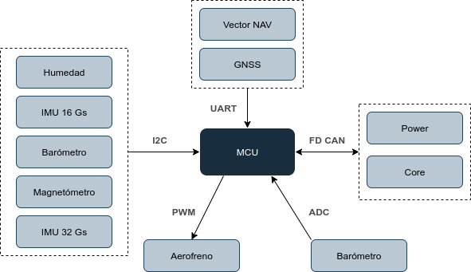

# evaluation_avionica_g4_v0
Placa de desarrollo Nucleo-G474RE para componentes del módulo de sensores de aviónica

# Desarrolladores: 
    - José Alejandro Ramos Tovar
    - Marcos Ocón Madrid

# Objetivo:
    Desarrollo e implementación del código de vuelo de la placa de sensores/aviónica del 
    cohete fabricado por el LEEM en 2025. 
    Dicho código ejecutara dos tareas principales. La primera será la obtención de las 
    medidas realizadas por los sensores y su segunda función será la de procesar dichas 
    medidas para sacar datos de vuelo relevantes (ej: procesar las aceleraciones axiales 
    y velocidades angulares, para sacar posición y velocidad en tiempo real).

# Sensores de la placa:

    - IMU Principal (hasta 16Gs)    -> WSEN-ISDS 6 Axis IMU (Wurth Electronik)

        Esta será la IMU principal de la placa de donde se extraerán los datos de 
        aceleración axial del acelerómetro, y velocidad angular del giroscopio. Para 
        obtener datos más precisos será importante calibrar el sensor antes del vuelo 
        del cohete. Dicho sensor tiene la oción de medir desde +-2g a +-16g, y +-250dps
        hasta +-2000dps. Para más información técnica se puede consultar el manual del 
        fabricante a continuación: 
        
        https://www.we-online.com/components/products/manual/Manual_UM_WSEN-ISDS_2536030320001%20(rev1.3).pdf

        Driver: https://github.com/WurthElektronik/Sensors-SDK_STM32/tree/main/SensorsSDK/WSEN_ISDS_2536030320001

    - IMU de altas Gs (hasta 32Gs)  -> LSM6DSV32XTR 6 Axis IMU

        Esta será la IMU de altas Gs usada por la placa de avionica cuando se supere el 
        rago de aceleraciones de +-16g. Los valores máximos y mínimos de medición del 
        acelerómetro y giroscopio de este sensor serán desde +-4g a +-32g, y desde 
        +-125dps a +-4000dps. Para más información técnica se puede consultar el manual 
        del fabricante a continuación:

        https://www.st.com/resource/en/datasheet/lsm6dsv32x.pdf

    - 2 Barometros                  -> WSEN PADS (Wurth Electronik)

        Ambos barómetros presentes en la placa son del mismo modelo, sin embargo estan 
        puestos en extremos de ella, y se usarán dos por redundancia y para descartar 
        medidas espurias. Dichos barómetros darán medidas de presión, que mediante su 
        procesamiento podrán servir para calcular la altura teórica del cohete o para 
        modelizar el drag aplicado sobre este en ese instante. Además, dichas medidas se 
        podrán combinar con el procesamiento de datos del resto de senores (ej: las IMUs
        , el magnetómetro y el GPS) mediante un filtro de Kalman, para mejorar el 
        posicionamiento vertical teórico del cohete. Para más información técnica sobre 
        este sensor consutlat el manual del fabricante a continuación:

        https://www.we-online.com/components/products/manual/Manual-um-wsen-pads-2511020213301%20(rev3.0).pdf

        Driver: https://github.com/WurthElektronik/Sensors-SDK_STM32/tree/main/SensorsSDK/WSEN_PADS_2511020213301
        
    - Magnetómetro                  -> MLX90393ELW-ABA-014-SP 3 Axis Magnetometer

        Este magnetómetro presente en la placa servirá para conocer en todo momento la 
        dirección del campo magnético, la cual, conociendo la orientación teórica del 
        cohete permitirá corregir dicha orientación a una que se aproxime más a la real.
        El campo magnético máximo que podrá medir dicho sensor será de 50 mT, por ello 
        es importante colocarlo lejos de fuentes de intensidad que puedan generar un 
        campo magnético al rededor y afectar a las mediciones del sensor. Para más 
        información, consultar el manual del sensor a continuación:

        https://eu.mouser.com/ProductDetail/Melexis/MLX90393ELW-ABA-014-SP?qs=4pzlT8jjbhc1GB0OqKEoCw%3D%3D
        
    - GPS                           -> MAX-M10S-00B GPS

        Este sensor permitirá conocer la posición nominal del cohete en los tres ejes,
        es importante recalcar que en su operación nominal puede llegar a tener un error
        de 1.5m, sin embargo a velocidades mayores a 30m/s, este error crece ampliamente
        y no puede ser usado para conocer la posición precisa del cohete. Además, el 
        sensor puede funcionar desde frecuencias de 4Hz hasta 25Hz, dependiendo del 
        número de constelaciones que esté usando. Dicho sensor puede ser usado para la 
        corrección de la posción en 3 dimensiones del cohete sobre todo en su etapa de 
        descenso (ya que en el ascenso se alcanzan velocidades superiores a los 30m/s). 
        Para más información, consultar el manual técnico a continuación:

        https://content.u-blox.com/sites/default/files/MAX-M10S_DataSheet_UBX-20035208.pdf

        Librería NMEA: https://github.com/kosma/minmea

    - Sensor de Humedad             -> WSEN-HIDS (Wurth Electonik)

        El sensor de humedad presente en la placa permitirá conocer la humedad existente 
        en el interior del cohete. Dichos datos podrán ser usados para conocer el estado
        de la electrónica y apagarla en caso de emergencia (ej: si esta se moja). Además,
        dicho sensor podrá ser usado en experimentos futuros. Para más información 
        consultar el manual técnico del sensor a continuación:

        https://www.we-online.com/components/products/manual/UM_WSEN-HIDS_2525020210002%20(rev1.2).pdf

        Driver: https://github.com/WurthElektronik/Sensors-SDK_STM32/tree/main/SensorsSDK/WSEN_HIDS_2525020210002

